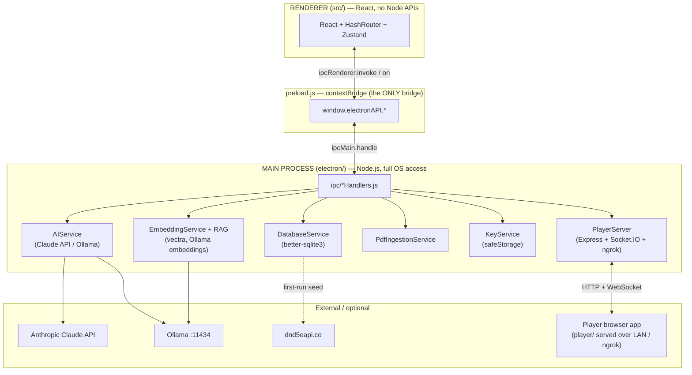

# Dungeon Master's Campaign Suite (DMCS)

**A local-first Electron desktop app that gives a D&D 5e Dungeon Master one place to run an entire campaign — world building, maps, characters, encounters, a compendium, optional AI, and live player views.**

DMCS solves the "twelve browser tabs and a stack of PDFs" problem. Everything a DM needs during prep and at the table — NPCs and factions, battle maps with fog of war, full 5e character sheets, encounter/initiative tracking, and a searchable monster/spell/item compendium — lives in a single offline desktop app backed by a local SQLite database. AI is **optional** and, when enabled, can answer rules questions from your own uploaded PDFs and import sourcebook content into the compendium. Players can connect to a read-only view of the map and their character sheet, either through a second Electron window or a browser over your LAN / an ngrok tunnel.

**Version:** 1.0.0 — all 8 build phases complete.

---

## Screenshot

> _UI/desktop app — add a screenshot of the main DM window (Campaign Manager or Map Engine) here._
> ``
> _(No screenshot is committed yet; the path above is a placeholder.)_

---

## Table of Contents

1. [Tech Stack](#tech-stack)
2. [Prerequisites](#prerequisites)
3. [Setup](#setup)
4. [Environment Variables](#environment-variables)
5. [Running the Project](#running-the-project)
6. [Architecture](#architecture)
7. [Project Structure](#project-structure)
8. [Core Usage (the IPC chain)](#core-usage-the-ipc-chain)
9. [Database Schema](#database-schema)
10. [Modules](#modules)
11. [AI Layer](#ai-layer)
12. [AI that writes to the world](#ai-that-writes-to-the-world)
13. [Sessions, plot threads and reveals](#sessions-plot-threads-and-reveals)
14. [Combat that survives](#combat-that-survives)
15. [Player Views](#player-views)
16. [Testing](#testing)
17. [Building the Windows Installer](#building-the-windows-installer)
18. [Troubleshooting](#troubleshooting)
19. [Open Questions](#open-questions)
20. [License](#license)

---

## Tech Stack

Versions are transcribed from `package.json` (semver ranges as written there).

| Layer | Package | Version |
|---|---|---|
| Language | JavaScript + JSX | — (no `tsconfig.json`; `@types/*` are editor aids only) |
| Package manager | npm | `package-lock.json` committed |
| Node runtime | — | **Not pinned** — no `engines` field (see [Prerequisites](#prerequisites)) |
| Desktop shell | electron | `^33.2.1` |
| UI | react / react-dom | `^18.3.1` |
| Build tool | vite / @vitejs/plugin-react | `^6.0.1` / `^4.3.3` |
| Routing | react-router-dom | `^6.27.0` (**HashRouter** — see [Architecture](#architecture)) |
| State | zustand | `^5.0.1` |
| Database | better-sqlite3 (SQLite) | `^12.10.0` |
| Maps / canvas | konva / react-konva | `^10.3.0` / `^18.2.10` |
| Mind map | @xyflow/react (React Flow) / @dagrejs/dagre | `^12.11.0` / `^3.0.0` |
| AI — online | @anthropic-ai/sdk (Claude API) | `^0.100.0` |
| AI — offline | Ollama (local HTTP, no npm dep) | — |
| PDF parsing | pdf-parse | `1.1.1` (pinned via `overrides`) |
| Vector search | vectra | `^0.15.0` |
| Remote Player Network | express / socket.io / socket.io-client | `^5.2.1` / `^4.8.3` / `^4.8.3` |
| Canvas | konva / react-konva | `^10.3.0` / `~19.0.10` — **pinned with `~`, not `^`**: react-konva 19.0.8 is the first release accepting konva 10, and 19.0.x still supports React 18. 19.2.x requires React 19, which a caret range would drift onto. |
| Tunnel / QR | @ngrok/ngrok / qrcode | `^1.7.0` / `^1.5.4` |
| Image export | html-to-image | `^1.11.13` |
| Packaging | electron-builder / @electron/rebuild | `^25.1.8` / `^4.0.4` |

> **Note:** These library choices are treated as locked for the project. Don't substitute them without updating this README and the `DMCS_*` spec docs.

---

## Prerequisites

### Required to run in development

- **Node.js 20–22** and **npm 10+** — pinned by `.nvmrc` (`20`) and `package.json`'s `"engines": { "node": ">=20 <23" }`. The upper bound is deliberate: `better-sqlite3` is a native module and Node 23+ has not been validated against Electron 33's ABI. See [Troubleshooting](#better-sqlite3-node_module_version-mismatch) for what goes wrong.
- **Native build toolchain** for compiling `better-sqlite3` during `npm install`:
  - **Windows:** Python 3 + Visual Studio Build Tools (C++)
  - **macOS:** Xcode Command Line Tools
  - These are needed only to *install/build* the app, never by end users of the packaged installer.

> ⚠️ **Path-with-spaces caveat — confirmed, not theoretical.** `node-gyp` fails on directories containing spaces. Verified in Phase 4.5: the same tree that would not build at `C:\Users\...\Dungeon Master Campaign Suite` built cleanly at `C:\dev\dmcs` with no other change. **Clone or move to a space-free path before `npm install`.**

### Optional (only for AI features)

- **Anthropic API key** — for online Claude features. Entered in the app's Settings (stored via Electron `safeStorage`), not as an env var.
- **Ollama** — for fully offline AI. Install from [ollama.com](https://ollama.com), then pull the models DMCS uses:
  ```bash
  ollama pull llama3            # chat / extraction model
  ollama pull nomic-embed-text  # required for PDF embedding + RAG
  ```
- **ngrok auth token** — only if you want remote players to connect over the internet (entered in Settings).

The base app is fully usable with **no AI and no network**.

---

## Setup

```bash
# 1. Clone
git clone git@github.com:Dreadseer/Dungeon-Master-Campaign-Suite.git
cd "Dungeon Master Campaign Suite"

# 2. Install dependencies
#    postinstall runs: electron-rebuild -f -w better-sqlite3
#    (rebuilds the native SQLite module for this Electron version)
npm install

# 3. Launch in development
npm run dev
```

`npm run dev` runs two processes in parallel (via `concurrently`):
- **Vite dev server** on `http://localhost:5173`
- **Electron** (with `NODE_ENV=development`), which waits for Vite then loads it.

On first launch DMCS will, automatically:
1. Create its SQLite database under the OS user-data directory (see [Where is the database?](#where-is-the-database)).
2. Run all **12** database migrations in order (`DatabaseService.runMigrations()`).
3. Seed the SRD cache (monsters, spells, equipment, classes) from `https://www.dnd5eapi.co` — **once**, over the network, then cached locally.

**Verified in this environment:** `npm install` and `npm run build:renderer` (`vite build`) both succeed. The full installer build is covered in [Building the Windows Installer](#building-the-windows-installer). `npm run dev` opens a GUI and was not exercised headlessly.

---

## Environment Variables

DMCS uses **one** environment variable, and there is **no `.env` file** — nothing is required to run it.

| Name | Required? | Purpose | Set by |
|---|---|---|---|
| `NODE_ENV` | No | `=== 'development'` selects the Vite dev server; otherwise the packaged renderer is loaded from disk. Read at `electron/main.js:23,53,122` and `electron/server/PlayerServer.js:25`. | Automatically by the npm scripts (`cross-env NODE_ENV=development`). You do not set it manually. |

Secrets are **not** env vars: the Anthropic API key and ngrok token are entered in the app UI and encrypted with Electron `safeStorage` (`electron/services/KeyService.js`).

---

## Running the Project

| Command | What it does |
|---|---|
| `npm run dev` | DM app: Vite dev server (`:5173`) + Electron with hot reload for React. |
| `npm run dev:player` | Browser player app dev server (Vite on `:5174`), proxying `/api` and `/socket.io` to the Express server on `:3001`. |
| `npm run build:renderer` | Production build of both renderers → `dist/renderer/` (DM) and `dist/player/` (browser player). |
| `npm run build` | `build:renderer`, then `electron-builder` (packages for the current OS). |
| `npm run build:win` | `build:renderer`, then the Windows NSIS installer (`electron-builder --win nsis --x64`). See [Building the Windows Installer](#building-the-windows-installer). |
| `npm run electron` | Runs Electron against an already-running Vite server. |

**Hot reload:** Vite hot-reloads everything under `src/`. The Electron **main process does not hot-reload** — after editing anything in `electron/`, quit and restart `npm run dev`.

---

## Architecture

### Two-process model

Electron runs two isolated JavaScript environments that cannot share memory. All database, file, AI, and server work happens in the **main process**; React runs in the sandboxed **renderer** and reaches main only through a narrow `window.electronAPI` bridge exposed by `preload.js`.



> **Rule:** Never `import` `better-sqlite3`, `fs`, `path`, `@anthropic-ai/sdk`, `express`, etc. inside `src/` — it crashes the renderer. Everything crosses through IPC.

### Why HashRouter (not BrowserRouter)

The renderer uses **`HashRouter`** (`src/App.jsx`). In a packaged build the renderer is loaded from disk with `loadFile(...)` (a `file://` URL), where path-style routing can't resolve deep routes like `/player`. Hash routing keeps the route in the URL fragment (`index.html#/player?campaign=1`), which resolves correctly from `file://`. The secondary windows (Player View, pop-out combat map) rely on this.

---

## Project Structure

Top two levels, annotated. `dist/`, `node_modules/`, and the `DMCS_*.md` design/spec docs are omitted.

```
Dungeon Master Campaign Suite/
├── electron/                 # MAIN process (Node.js)
│   ├── main.js               # Entry: window creation, service wiring, IPC registration
│   ├── preload.js            # contextBridge → window.electronAPI (the only renderer bridge)
│   ├── database/             # DatabaseService.js — SQLite connection, 12 migrations, CRUD
│   ├── services/             # AIService, EmbeddingService, RAGService, PdfIngestionService,
│   │                         #   SrdService, KeyService
│   ├── ipc/                  # *Handlers.js — ipcMain.handle for db:/ai:/srd:/pdf:/embed:/…
│   └── server/               # PlayerServer.js — Express + Socket.IO for the browser player
│
├── src/                      # RENDERER (React) — DM window
│   ├── main.jsx / App.jsx    # React entry; HashRouter + routes
│   ├── PlayerApp.jsx         # Root for the in-app Electron Player View (#/player)
│   ├── pages/                # One file per module (CampaignManager, MapEngine, Compendium, …)
│   ├── components/           # Feature + shared components (map/, character/, compendium/, …)
│   ├── stores/               # Zustand: campaignStore (persisted), playerStore
│   └── utils/                # Pure helpers: dnd5e.js, fogUtils.js, compendiumExtractor.js, …
│
├── player/                   # Browser player web app (separate Vite build → dist/player)
│   ├── main.jsx / PlayerWebApp.jsx / index.html / components/
│
├── tools/                     # dmcs-agent.mjs — unrelated LM Studio experiment (see tools/README.md)
├── scripts/                  # verify-*.mjs harnesses (npm-wired: migrations, ipc, rag,
│                             # sessions, player server), doctor.mjs, and the Playwright
│                             # UI driver (ui-driver.mjs + ui-verify*.mjs)
├── assets/                   # electron-builder buildResources (icon.png)
├── vite.config.js            # DM renderer build (base './', outDir dist/renderer)
├── vite.player.config.js     # Browser player build (root player/, outDir dist/player, dev :5174)
└── package.json              # Scripts + electron-builder "build" config
```

---

## Core Usage (the IPC chain)

Every database/AI/file call from React follows the same four-layer path. To add a feature you must touch **all four layers** or it silently no-ops.

`npm run test:ipc` checks the two layers that can be checked statically — it cross-references every `ipcRenderer.invoke` literal in `preload.js` against every `registerHandler` literal in `electron/ipc/*.js` and `electron/main.js`, and fails on a channel that exists on only one side. Run it after adding a channel.

```
React component
    │  window.electronAPI.db.subclasses.create(data)
    ▼
electron/preload.js
    │  ipcRenderer.invoke('db:subclasses:create', data)
    ▼
electron/ipc/dbHandlers.js
    │  registerHandler('db:subclasses:create', (_, data) => global.db.createSubclass(data))
    ▼
electron/database/DatabaseService.js
    │  this.db.prepare('INSERT INTO subclasses …').run(…)
    ▼
SQLite file on disk
```

Real call sites from the current code (all verified in `electron/preload.js`):

```javascript
// Database CRUD
const rows   = await window.electronAPI.db.pdf.getAll(activeCampaign.id)
await window.electronAPI.db.subclasses.create({ class_name, name, description, unlock_level, features })

// AI completion (system, user, options) — options.maxTokens is threaded through
const raw    = await window.electronAPI.ai.complete(system, user, { maxTokens: 8192 })
// getMode resolves to an OBJECT, not a string. Destructure it — comparing the
// whole result to 'no-ai' is silently always false, which is exactly the bug
// Phase 1 fixed in AISuggestionPanel.
const { mode } = await window.electronAPI.ai.getMode()  // 'online' | 'offline-ollama' | 'no-ai'

// Semantic search over indexed PDF chunks (used by the Source Book Importer)
const chunks = await window.electronAPI.embed.search(query, topK, itemKeys, sourceId)
```

### Errors

Every `window.electronAPI.*` call must be wrapped. Main-process handlers all run
through `registerHandler` (`electron/ipc/registerHandler.js`), which logs
`[ipc] <channel> failed:` with the full error and rethrows a clean message; the
renderer turns that into a toast:

```javascript
import { notifyError, notifySuccess } from '../stores/toastStore'

try {
  await window.electronAPI.db.locations.delete(loc.id)
  notifySuccess(`Deleted "${loc.name}".`)
  load()                       // reload ONLY on success
} catch (err) {
  notifyError(err, 'Delete location')
}
```

`notifyError` parses Electron's `Error invoking remote method '<channel>':`
wrapper off the message and rewrites the common database failures into plain
language (`FOREIGN KEY constraint failed` → "Something else still refers to
this. Remove or reassign it first."), keeping the raw text behind a "Show
details" toggle. Unrecognised messages pass through verbatim.

Do not reload the list in the `catch`. The row is still there, and re-fetching
makes a failed delete look like nothing was attempted.

See [`DMCS_Source_Book_Importer.md`](DMCS_Source_Book_Importer.md) for a worked end-to-end example (search → extract → parse → save).

---

## Database Schema

The database is created and migrated automatically on first launch — you never run migrations manually. `DatabaseService.runMigrations()` applies these in order:

| ID | Name | Adds |
|---|---|---|
| 001 | `core_schema` | Base tables (campaigns, locations, factions, npcs, connections, characters, encounters, maps, compendium_custom, srd_cache, mind_map_positions) |
| 002 | `connections_lore` | `campaign_id` on connections; `'lore'` type in `compendium_custom` |
| 003 | `pdf_chunks` | `pdf_sources` + `pdf_chunks` tables (RAG pipeline) |
| 004 | `embedding_columns` | `embedded` / `embedding_model` columns on `pdf_chunks` |
| 005 | `ai_usage_log` | `ai_usage_log` table |
| 006 | `subclasses` | `subclasses` table (+ seed subclasses) |
| 007 | `encounter_map_loc_fields` | Encounter ↔ map/location linking fields |
| 008 | `compendium_source_book` | Source-book / page attribution fields on compendium entries |
| 009 | `referential_integrity` | Foreign keys and `ON DELETE` behaviour across the world tables (Phase 1) |
| 010 | `shared_pdf_sources` | Drops `NOT NULL` from `pdf_sources.campaign_id`, so an SRD source can be shared (Phase 3) |
| 011 | `sessions_plots_reveals` | `sessions`, `plot_threads`, `reveals` and their link tables; copies each campaign description into a first session (Phase 4) |
| 012 | `combat_state` | One saved fight per encounter, so combat survives navigation and relaunch (Phase 5) |

> Registered at `electron/database/DatabaseService.js:24-46`. Exact column definitions live in the `MIGRATION_0NN` constants in that file.

`combat_state` holds the whole fight as two JSON blobs — `combatants` and
`log_entries` — under a `UNIQUE(encounter_id)`, so saving is an upsert and an
encounter can never accumulate two fights. Both blobs are written inside a
versioned envelope (`{ schema_version, combatants }`), which is what lets
`src/utils/combatPersistence.js` upgrade an older save rather than discard it. A
row is deleted only when the DM ends combat; `ON DELETE CASCADE` from both
`campaigns` and `encounters` takes care of the rest.

Several columns store JSON strings (SQLite has no JSON type) — always `JSON.parse()` on read and `JSON.stringify()` on write. Examples: `characters.stats`, `characters.inventory`, `characters.spell_slots`, `maps.fog_data`, `maps.tokens`, `encounters.monsters`, `subclasses.features`.

### Where is the database?

The path depends on how DMCS is running, because Electron derives the user-data folder from the app name:

| Context | App name source | Windows path |
|---|---|---|
| **Development** (`npm run dev`) | `package.json` `"name": "dmcs"` | `%APPDATA%\dmcs\dmcs.db` |
| **Packaged / installed** | `build.productName` `"DM Campaign Suite"` | `%APPDATA%\DM Campaign Suite\dmcs.db` |

macOS/Linux follow the same pattern (`~/Library/Application Support/<name>/` and `~/.config/<name>/`). **Consequence:** campaigns created with `npm run dev` do **not** appear in the installed app — they live in different folders. Inspect either file with [DB Browser for SQLite](https://sqlitebrowser.org/).

### Adding a new table (all four IPC layers)

1. Add `const MIGRATION_012 = \`CREATE TABLE …\`` in `DatabaseService.js`. **(ids 1–11 are taken.)** Never edit an existing `MIGRATION_0NN` — migrations are append-only.
2. Append `{ id: 12, name: 'my_table', sql: MIGRATION_012 }` to the `migrations` array.
3. Add CRUD methods to `DatabaseService`.
4. Register `registerHandler('db:myTable:*', …)` in `electron/ipc/dbHandlers.js`.
5. Expose them on `window.electronAPI.db.myTable.*` in `electron/preload.js`.
6. Call from React: `await window.electronAPI.db.myTable.getAll(campaignId)`, in a `try`/`catch`.
7. Run `npm run test:ipc` to confirm the channel names match across layers.

**Changing a foreign key or a CHECK constraint** is different: SQLite cannot
`ALTER` either one, so the table has to be recreated (create new, `INSERT ...
SELECT` with an explicit column list, drop old, rename new — never rename the
*old* table, or SQLite rewrites every child table's `REFERENCES` clause to point
at your temporary name). That procedure needs foreign keys disabled and has to be
atomic, and `PRAGMA foreign_keys` is silently ignored inside a transaction — so
mark the entry `foreignKeysOff: true` and the runner handles the toggle,
transaction and `PRAGMA foreign_key_check` for you. `MIGRATION_009` (six tables)
and `MIGRATION_010` (dropping a `NOT NULL`) are the worked examples.

**Migrating data as well as schema** — for example copying a column into a new
table — goes in an `after` hook on the migration entry, not a separate step:
`{ id: 11, name: '…', sql: MIGRATION_011, after: importCampaignNotes }`. The
runner puts the DDL and the hook in one transaction, so they commit or roll back
together. A half-applied data import is worse than none: it leaves some rows
migrated and some not, and any idempotence check then skips the rest forever.
`MIGRATION_011` is the worked example. Per standing rule 10, such a hook
**copies** — it must never delete the column it read.

---

## Modules

| Module (page) | Summary |
|---|---|
| Campaign Manager | Create / load / rename / delete campaigns; the active campaign is held in `campaignStore` (persisted to `localStorage`). The notes box edits the **current session's** notes, not the campaign description (Phase 4). |
| World Builder | Factions, Locations, NPCs, Lore, **Sessions**, **Plot Threads**, and named Connections. The AI suggestion panel now **saves** what it proposes, with the links between records (Phase 6). The separate "Lore & Connections" page was removed in Phase 1 — it duplicated `/world/lore` and `/world/connections`. |
| Sessions | One row per session played, with long-form notes that autosave on blur. Shows the plot threads opened or closed in each session and what the party learned in it, and generates **AI recaps** in DM and player variants. |
| Plot Threads | A board of what is unresolved, grouped open / active / resolved / abandoned. Closing a thread stamps it with the session in progress. |
| Mind Map | React Flow graph of all world entities with Dagre auto-layout and PNG export. |
| Map Engine | Upload battle maps, paint fog of war, place tokens; opens a pop-out combat-map window. Changing a map's grid size re-indexes the fog mask, so saving a new size on a painted map asks for confirmation and then clears the fog. |
| Compendium | Browse SRD monsters/spells/equipment + homebrew, **and** the [Source Book Importer](DMCS_Source_Book_Importer.md) (📥 Single / 📦 Bulk) that turns indexed PDF passages into structured entries via AI. |
| Character Sheets | Full 5e sheets (stats, inventory, spell slots, death saves) with a level-up wizard and AI assistant. |
| Encounter Builder | Build encounters from SRD monsters; XP/difficulty calculator; initiative tracker. **Combat is saved as it happens** (Phase 5) — see below. |
| Combat Calculator | Standalone XP/CR calculator. |
| AI Assistant | Streaming chat with **budgeted** campaign context and retrieval over your own lore; "Save as…" turns any reply into saved records; history persists per campaign. "Rules Q&A" routes through the RAG pipeline. |
| AI Sources | Upload PDFs, monitor indexing, trigger embedding. |
| Settings | Anthropic key (safeStorage), Ollama status, RAG settings, **Rules Q&A index**, ngrok token, AI usage stats (including failed calls). |

---

## AI Layer

On startup the app picks a mode (shown as a badge in the TopBar):

1. Valid Anthropic key in `safeStorage` → **`online`** (Claude API, model `claude-sonnet-5`).
2. Else Ollama reachable at `http://localhost:11434` → **`offline-ollama`** (`llama3:latest` chat).
3. Else **`no-ai`** — AI-generated content hides; the rest of the app works normally, **including rules Q&A** (see below).

### Rules Q&A

Works on a fresh install with nothing uploaded and no API key.

**Settings → Rules Q&A Index → "Index SRD for rules Q&A"** serialises the bundled
SRD 5.1 cache (monsters, spells, equipment, classes) into text and chunks it into
`pdf_chunks` under a shared source named `SRD 5.1`. This also runs automatically
the first time the SRD is seeded.

The index has two useful states, and the first one is not a failure:

| State | Needs | What you get |
|---|---|---|
| **Keyword search ready** | nothing | SQLite keyword retrieval over the SRD |
| **Semantic search ready** | Ollama + `nomic-embed-text` | vector retrieval, better on paraphrased questions |

Retrieval always searches **your campaign's own uploaded books plus the shared
SRD**. Sources are scoped per campaign — campaign B never retrieves campaign A's
homebrew PDF — but the SRD is shared by all of them, so a brand-new campaign is
not starting from nothing.

**Each AI mode degrades rather than failing:**

- `online` / `offline-ollama` — a grounded answer with citations.
- `no-ai` — the retrieved passages render directly under a **"Relevant passages"**
  heading. No answer is generated, and none is needed for most single-rule
  lookups: the SRD text *is* the answer. This used to throw "No AI service
  available".
- Ollama not running — retrieval falls back to keyword search and the result is
  labelled *"Keyword search — Ollama is not running"* rather than quietly
  returning worse hits.

**Situation mode** (requires AI; the toggle is hidden in `no-ai`) breaks a
multi-rule table situation into 2–5 rules concepts, retrieves for each, and rules
over the union — for questions like "the grappled rogue wants to cast a spell
with somatic components underwater", where a single embedding of the whole
sentence lands between four rules and retrieves none of them well.

**RAG / PDF pipeline:** upload a PDF → `PdfIngestionService` chunks it (~400
tokens) into `pdf_chunks` → `EmbeddingService` embeds each chunk with Ollama
`nomic-embed-text` into a `vectra` index → on a query, chunks are over-fetched,
filtered to the sources this campaign may see, and stitched contiguously before
going to the model. Embeddings require Ollama; retrieval does not.

---

## AI that writes to the world

Before Phase 6 the AI could only talk. It generated suggestions and displayed
them; nothing it said was ever saved. A DM who liked an idea re-typed it by hand
into three separate forms. It was also working half-blind: the World Builder's
prompt sent the campaign name, three integer counts and the names of the first
three NPCs — it knew a world had "12 locations" and not what any of them were.

### Suggestions become records

The World Builder's **AI World Suggestions** panel takes a free-text request
("a rival thieves' guild in Waterdeep") as well as the generic "suggest 3
things". The model answers in strict JSON, and each suggestion renders as a card
with every field editable inline, a **Save**, and a **Save all** that also writes
the `connections` between them.

The same cards appear from the AI Assistant's **Save as…** action on any
assistant message, running the same structured extraction over that message's
text — so an idea in chat is one click from being a saved faction.

What the pure layer (`src/utils/worldSuggestions.js`) guards against, each of
which the DM would otherwise meet as a raw `SqliteError` mid-save:

| Problem | Behaviour |
|---|---|
| `locations.type` has a CHECK constraint, and a model asked for a guild answers `"guildhall"` | Synonyms are mapped; anything unrecognised becomes `landmark`. It can never return a value outside the constraint. |
| A link points at something that was never saved | Reported in the toast — "2 links could not be matched" — never dropped silently. |
| A→B and B→A both proposed | Collapsed into one row. Connections are undirected in practice and the Mind Map draws both as one edge. |
| Two suggestions share a name | The duplicate is dropped; a name that already exists in the campaign is flagged before saving, not blocked. |
| One entry is malformed | It drops itself. Four good suggestions and one with no name gives the DM four cards, not an error. |

The JSON repair rules are **not** duplicated: `extractJsonObject` /
`extractJsonValue` in `compendiumExtractor.js` are the one parser, shared with
the PDF importers. `extractJsonValue` also accepts a top-level array, because
asked for `{ suggestions: [...] }` a local model frequently answers with just
the array.

### The AI knows your world

`src/utils/aiContext.js` replaces the old `buildSystemPrompt`, which
interpolated *every* character and *every* faction with no cap — 60 factions
meant 60 names in every message, silently — and included no lore, no locations
and no descriptions.

Sections are now filled in **priority order** under a character budget
(default 6,000, set in Settings → RAG Settings):

1. campaign and setting 2. the party 3. the current session
4. open plot threads 5. locations with one-line descriptions
6. factions 7. NPCs 8. lore titles

So when a world is too large to describe, it is the long tail of NPC names that
is dropped, never the party or the session being run. The prompt says how many
it left out — a model told about 17 of 60 factions with no hint of the rest will
assert those 17 are all of them. The AI page shows the usage and which sections
made it in.

### Retrieval over your own lore

The capability review's sharpest point was that DMCS already had a working
retrieval pipeline and had never aimed it at the DM's own world. So campaign
lore is indexed as an ordinary source rather than through a second system: one
sentinel `pdf_sources` row per campaign (`Campaign lore — <name>`, with no
`file_path`) and one `pdf_chunk` per lore entry, NPC, location and faction.
`embedSource`, `search` and `deleteSource` work unchanged — including the
keyword fallback, so retrieval still returns something useful without Ollama.

Two properties worth knowing:

- **A re-sync never touches an imported PDF.** The sentinel is identified by its
  filename prefix *and* a null `file_path`, and `assertOwnSource` is checked
  before any write.
- **Editing one entity re-embeds one entity.** Chunks are matched by text, so
  unchanged ones keep their row and their vector.

Index it from the AI page (🧠 budget pill → **Index now**). Each message then
pulls the top 3 relevant campaign entries into context, scoped to that source so
a question about your campaign does not come back with passages from the
Player's Handbook. The **Check for contradictions** button on a suggestion card
retrieves the same way and asks the model to flag conflicts before you save.

### Encounter advice you can apply

The AI Difficulty Advisor returned prose; a DM read "drop one goblin and add an
archer" and then did it by hand. It now returns operations —
`{ action: 'add'|'remove'|'replace', monster_index, count }` — with an **Apply**
button each, and the prompt hands the model the SRD index of every roster entry,
because a suggestion naming "the big orc" cannot be applied to anything.
`checkAdvice` reports *why* a suggestion cannot be applied, so the button is
disabled with a reason rather than failing on click.

### Chat that survives a restart

`aiStore` uses zustand's `persist`, the same middleware `campaignStore` has used
since Phase 1. History is kept **per campaign** — one shared log would show a DM
notes from a different world the moment they switched. `isStreaming` is
deliberately not persisted: restoring it would leave the composer disabled with
no way back.

### Without AI

Every AI surface hides behind a clear "AI not configured" panel in `no-ai` mode,
and the app remains fully usable — the Phase 6 sweep found two guards that had
never worked (`ai:getMode` resolves to an **object**, and comparing it to a
string is always false) and two importers with no guard at all.

`DMCS_OLLAMA_URL` overrides the Ollama endpoint, for a DM running it on another
port or machine — and so the UI driver can point at a dead port to exercise
`no-ai` on a machine where Ollama is installed.

---

## Sessions, plot threads and reveals

Added in Phase 4. Before it, a campaign had no memory: `campaigns.description`
was a single textarea that every session overwrote, so a DM either kept one
ever-growing wall of text or lost last week's notes writing this week's.

| Table | Holds |
|---|---|
| `sessions` | One row per session played: number, title, date, long-form notes, recap |
| `plot_threads` | What is unresolved, and which session opened and closed it |
| `reveals` | What the party has actually been told, as opposed to what the DM knows |

**Notes autosave on blur.** A DM typing during a game will not remember to press
a button. The Sessions page and the Campaign Manager's notes box both write to
the *current session*; the Campaign Manager also has a "+ New session" button.
Typing into an empty notes box on a campaign with no sessions starts session 1
rather than dropping what was typed.

`campaigns.session_count` is finally true — it had been read and never written
since it was added.

### `is_secret` versus revealed

These are independent and mean different things:

- **`is_secret`** — DM-only. Do not put this in front of a player.
- **A reveal** — the party has learned this, whether or not it was ever secret.

A thing can be secret and unrevealed (most things), public and unrevealed (just
hasn't come up yet), or revealed. The 👁 toggle on lore entries, NPCs, locations
and factions records a reveal, stamped with the session in progress, so *"what
did the party learn in session 7"* is a one-line query. Revealing something
marked secret asks for confirmation first — it is the one direction that cannot
be taken back at the table.

### What players see

Revealed items appear in a **"What you know"** tab, in both the browser player
app and the in-app Electron player window.

Only player-facing fields are sent. An NPC's `secrets`, `motivation` and `notes`
and a location's `lore` are absent **by construction** — revealing an NPC means
the party has met them, not that they have read the DM's notes. The browser path
goes through `GET /api/campaign/:id/revealed`, token-scoped like every other
route (Phase 2), and `npm run test:server` asserts those DM-only fields appear
nowhere in the response.

### Data preservation

Migration 011 **copies** each non-empty `campaigns.description` into a first
session titled "Imported notes". The original column is left exactly as it was —
nothing is deleted, and `description` goes back to being a description of the
campaign, which is what the column was named for. The import is idempotent: a
campaign that already has a session is skipped.

---

### AI session recaps

**Generate recap** writes `sessions.recap` from the session's notes, the plot
threads that opened or closed in it, and what the party was shown. **Recap for
players** is the same for an audience that must not learn anything yet.

The player variant works by **filtering the input**, never by instructing the
model to withhold. A model told "do not mention the traitor" has the fact in
context and one line of instruction against it, and it will mention the traitor.
Unrevealed secret lore, NPC `secrets` and plot descriptions are removed before
the request is built, so there is nothing there to leak.

A reveal row *is* the record of having been shown something, so anything revealed
— this session or an earlier one — is fair game for players. Secret lore with no
reveal row anywhere is withheld from them, and shown to the DM under "still
hidden from the party".

> **One limitation, stated rather than hidden.** `sessions.notes` is free text.
> A DM who writes "Sera is secretly the traitor" there has put a secret where no
> structural filter can reach. The player prompt says the notes are private and
> asks for only what the party witnessed, and the UI repeats that above the
> generated text — but it is a mitigation, not a guarantee. Read a player recap
> before sharing it.

---

## Combat that survives

Before Phase 5 the initiative tracker rebuilt itself from the encounter on every
mount. Leaving the tracker and coming back lost the fight — initiative order, HP,
conditions, the log, all of it — and player HP only reached the `characters`
table when combat *ended*, so a crash mid-fight left every character at full
health.

**What is saved.** Every change to the roster, round, phase or log is written to
`combat_state` about half a second later, keyed on the encounter. The save is
skipped while the payload is unchanged, because React hands out new array
identities on every render and an idle tracker would otherwise rewrite the row
continuously. The tracker also saves on unmount, which is what navigating away
actually does.

**Resuming.** Opening an encounter loads its saved fight and falls back to
building a fresh one only when there is nothing stored. A fight left running is
advertised in two places, so it cannot be silently forgotten:

- the encounter card carries a "Combat in progress — round N" banner and its
  Open button becomes **Resume combat (round N)**;
- the top bar shows a **⚔ Combat in progress — round N** link on every screen,
  with the encounter name and how many combatants are still standing in the
  tooltip.

**Player HP** is written back to `characters` on every hit rather than at the
end, throttled to one write per second per character with the last value winning.
A crash now costs at most a second of damage.

**Ending combat** deletes the saved row. Nothing else does — this is the only
destructive path, and it is behind a confirm step.

### Rules the tracker now implements

| Rule | Behaviour |
|---|---|
| Temporary hit points | Absorb damage before real HP, take the *higher* of two grants rather than adding, and are never restored by healing. Granted through a third mode on the HP panel, shown as a badge beside the HP bar. |
| Death saves | Shown inline as pips for any player at 0 HP. A natural 20 revives at 1 HP and clears both counters; a natural 1 counts twice; healing a dying character clears the counters too. Synced into the character's `stats` blob. |
| Legendary actions | Clickable pips on any creature that has them; right-click a pip to undo a mis-click. Reset on round increment. |
| Reactions | A per-round toggle, also reset on round increment. |
| Lair actions | A row at initiative 20 that **loses** initiative ties, per the DMG. Display-only: it is not a creature, so it takes no turn, is never saved as a combatant, and gets no token on the map. |
| Armour class | Read from the stat block. Entries saved before Phase 5 carry no `ac`, so the tracker looks the creature up by its `source_index` rather than defaulting every monster to AC 10 forever. |

### The map follows the fight

`src/utils/tokenCombatLink.js` joins map tokens to combatants. Player tokens
match on `entity_id`; monsters exist only in the encounter's JSON, so they match
on name — and an **ambiguous name matches nothing**, because showing one of two
goblins' HP and letting the DM believe it is worse than showing nothing.

The tracker broadcasts `combat:update` with a trimmed roster and `combat:select`
on every turn change, and the pop-out map selects the token whose turn it is.
`player:broadcast` reaches the pop-out only, so the DM's own map polls
`db:combat:getActiveForCampaign` instead.

The two windows are deliberately **not** shown the same thing. The DM's
`TokenInspector` gives exact hit points and temp HP; the players' screen gives a
band — Unharmed / Wounded / Bloodied / Badly wounded / Down. Working out a
monster's hit point total is most of what a fight is, and per the player-server
security model below, the player window is not trusted with DM information.

---

## Player Views

DMCS has **two** distinct ways for players to see content:

1. **In-app Electron Player View** — a second `BrowserWindow` loading `#/player?campaign=<id>` (`electron/main.js` `createPlayerWindow`). Fog-enforced map (solid black over hidden cells), read-only character sheet, and live DM broadcasts relayed through the main process.
2. **Remote Player Network (browser)** — `electron/server/PlayerServer.js` runs an Express + Socket.IO server (default port **3001**, auto-increments if busy, binds `0.0.0.0`) that serves the `player/` web app. Players join from a browser over the LAN, or over the internet via an **ngrok** tunnel, using a QR code. See [`DMCS_Remote_Player_Network.md`](DMCS_Remote_Player_Network.md).

### Player server security

Every `/api/` route except `POST /api/join` requires the session token minted at
join time, sent as `Authorization: Bearer <token>` or `?token=` (the query form
exists for ``, which cannot set headers). The Socket.IO handshake requires
it too — an unauthenticated socket is refused before it connects.

**Tokens are scoped to one campaign.** A token for campaign 3 cannot read a map,
character, character list or map image belonging to campaign 4. The refusal is
`404`, not `403`: whether a resource exists in someone else's campaign is itself
information.

**Fog of war is enforced on the server.** `/api/map/:id` strips tokens standing
on unrevealed cells before responding, and the `map:update` socket broadcast gets
the same filter, so a live sync cannot leak what the REST route hides. Before
this, the server sent every token and the player's browser merely declined to
draw the hidden ones — devtools, or a single `curl`, showed the whole board.

The filter (`electron/server/fogFilter.js`) **fails closed**: if the map image
cannot be measured, or the saved fog mask's length does not match the current
grid, *every* token is withheld rather than guessed at.

**Tokens live in memory only.** They are never written to disk and die when the
server stops, so restarting the app ends every player session and everyone must
re-join. The player app says so when it happens.

**CORS is no longer `*`.** The allowed set is: same-origin (the player bundle is
served by this same Express instance), any `*.ngrok-free.app` / `.ngrok.io` /
`.ngrok.dev` host, any LAN address this machine answers on, and `localhost` only
when `NODE_ENV=development`. Anything else gets no CORS headers at all.

Run `npm run test:server` to verify all of the above against a real running
server.

> **Still true:** anyone who reaches the port can `POST /api/join` with a campaign
> id and a name, and receive a token for that campaign. Join is deliberately
> open — it is how players get in — so the tunnel URL is the shared secret. Do
> not post it publicly, and stop the server when the session ends.

---

## Testing

```bash
npm test              # vitest run — one pass, exits non-zero on failure
npm run test:watch
npm run test:migrations   # replays migrations 001-012 on a fresh AND a populated database
npm run test:ipc          # cross-checks channel names across the preload/handler layers
npm run test:server       # starts a real player server and checks auth, scoping and fog
npm run test:rag          # indexes the SRD and runs real queries, including in no-ai mode
npm run test:sessions     # migration 011, the notes import, and the sessions/plots/reveals SQL
npm run verify:combat     # Phase 5 acceptance, driven through the real app (see below)
npm run test:lore         # the campaign lore index, against a real database
npm run verify:ai         # Phase 6 acceptance — calls a real model, needs Ollama
```

### Driving the real app

`npm run verify:combat` launches Electron through Playwright, clicks the **built**
renderer, and records a screenshot per acceptance line into `scripts/screenshots/`
(gitignored). It is the answer to Phases 0-4 having shipped UI that was never
rendered once.

Two things make it safe and reproducible:

- every launch sets `DMCS_USER_DATA` to a scratch directory, so a driver run can
  never open the developer's campaign at `%APPDATA%/dmcs`;
- it drives `dist/renderer`, not the Vite dev server, so each run is
  self-contained and exercises the path that actually ships.

The crash-and-relaunch check closes the app with `app.close()` *without* ending
combat, relaunches against the same scratch directory, and compares the round,
the combatant count and a player's HP across the restart.

`scripts/ui-driver.mjs` exports the same helpers if you want to script a
scenario of your own.

`npm run verify:ai` is the one harness that needs a model. It calls Ollama for
real rather than stubbing it, because an 8B local model returning strict JSON is
exactly what the prompt discipline and the repair parser exist to survive. With
no model reachable it records the AI-dependent lines as NOT VERIFIED with the
reason rather than skipping them quietly.

None of the five `node` scripts need a working native `better-sqlite3` build:
they use Node's built-in `node:sqlite`, plain source parsing, or a stub database.
`test:rag` also runs without Ollama on purpose — it exercises the keyword-search
path that rules Q&A falls back to when Ollama is absent.

**Vitest**, configured inside the existing `vite.config.js` (`test` block) rather than a separate
config file. Environment is `node`; suites are discovered at `src/**/__tests__/**/*.test.js`. There is
no jsdom and no component testing yet — everything covered so far is a pure ES module.

| Suite | Covers |
|-------|--------|
| `src/utils/__tests__/encounterUtils.test.js` | All 80 `XP_THRESHOLDS` values against DMG 2014 p. 82, the six encounter-multiplier bands, CR→XP, party thresholds, difficulty ratings, `xpBudget` |
| `src/utils/__tests__/fogUtils.test.js` | Row-major index math, brush clamping at every map edge and corner, grid dimensions for non-divisible images, viewport culling |
| `src/utils/__tests__/combatUtils.test.js` | Initiative sort and DEX tiebreak, monster count expansion, turn wraparound, the 15 PHB conditions |
| `src/utils/__tests__/ipcError.test.js` | Unwrapping Electron's IPC rejection envelope; plain-language rewrites of the seven common database/filesystem failures |
| `src/utils/__tests__/locationUtils.test.js` | Ancestor-chain walking, cycle detection at any depth, the 50-hop bound |
| `src/utils/__tests__/mapGridUtils.test.js` | Counting painted fog cells; deciding when a grid-size change destroys a mask |
| `src/utils/__tests__/sessionUtils.test.js` | Session labelling and date formatting, next-session numbering, plot-status grouping and transitions |
| `electron/server/__tests__/fogFilter.test.js` | Server-side fog enforcement, asserted against the renderer's own `fogUtils` so the two copies cannot drift |
| `electron/server/__tests__/imageSize.test.js` | PNG/JPEG/GIF/WebP header parsing, including the JPEG markers that are not frame headers |
| `electron/services/__tests__/srdIndexText.test.js` | Serialising SRD monsters/spells/equipment/classes into indexable text, across both cache shapes |
| `electron/services/__tests__/queryExpansion.test.js` | All 15 condition names expanding, cross-checked against `combatUtils` |

### Known bugs are recorded as tests, not comments

Where a bug is known but not yet fixed, the suite holds **two** tests for it: one that passes and pins
the current (wrong) behaviour, and one marked `it.fails` asserting the *correct* behaviour. `it.fails`
passes only while its body throws — so when the fix lands, that test starts erroring and forces
someone to delete the modifier. It is a tripwire, not a skip. Each is paired with a `test.todo`, which
is why `npm test` reports a non-zero todo count.

**If a test in a `KNOWN BUGS` block fails after your change, that is usually good news** — read the
comment above it, delete the `.fails`, and remove the paired "current behaviour" test.

### What is *not* covered

No React component has a test — the toast queue, the error surfaces and every page are unexercised by
Vitest. Electron main-process *code* has no unit tests either, though the migration SQL and the IPC
channel wiring are now checked by the two `node` scripts above. The manual scripts remain the only
coverage for the services:

- `scripts/verify-*.js` / `*-electron.js` — **manual** verification scripts run in an Electron/Node
  context (e.g. `verify-db-electron.js`, `verify-srd-electron.js`, `verify-ai-electron.js`). They are
  not wired to an npm script and must be invoked directly. The `*-electron.js` variants must run
  inside Electron — see the ABI note in [Troubleshooting](#better-sqlite3-node_module_version-mismatch).
- `scripts/screenshot-driver.mjs` — a `playwright-core`-based screenshot helper.

---

## Building the Windows Installer

Produces `DMCS-Setup-1.0.0.exe` for non-technical Windows users. Full detail — including checklists — is in [`DMCS_RELEASE_GUIDE.md`](DMCS_RELEASE_GUIDE.md).

```bash
npm install        # first time only
npm run build:win  # → dist/app/DMCS-Setup-1.0.0.exe  (and dist/app/win-unpacked/)
```

**One-time Windows prerequisite:** electron-builder extracts a `winCodeSign` toolchain that contains symlinks, which Windows only allows with **Developer Mode enabled** (Settings → System → For developers) *or* an **Administrator** terminal. Without it, `win-unpacked/` is still produced but the final installer `.exe` fails with `Cannot create symbolic link`.

Notes:
- Close the running DMCS app before building (avoids a file lock on `better_sqlite3.node`).
- The build ships **unsigned**, so Windows SmartScreen shows "Windows protected your PC" — testers click **More info → Run anyway**. Code signing is a future step.
- App icon: drop a square `assets/icon.png` (see `assets/README.md`); electron-builder generates the `.ico`.

---

## Troubleshooting

### Blank white screen on launch
Vite wasn't ready when Electron started. Wait a moment and press `Ctrl+R`. If persistent, check the terminal for Vite errors.

### `better-sqlite3` "NODE_MODULE_VERSION mismatch"

**The cause: DMCS has two JavaScript runtimes, and `better-sqlite3` can only be compiled for one at a
time.** It is a *native* module - a `.node` binary compiled in C++ against a specific V8 ABI, stamped
with a `NODE_MODULE_VERSION` number. Electron 33 embeds its own V8 and reports ABI **130**; the Node
24 you may have on your `PATH` reports **137**. A binary built for one refuses to load in the other,
which is why the same install can work under `npm run dev` (Electron loads it) and fail under a plain
`node script.js` (Node loads it) - or the reverse, depending on which runtime it was last built for.

`npm install` compiles it against **Node**. The `postinstall` hook then runs `electron-rebuild`, which
recompiles it against **Electron**. So after a successful install the binary is Electron-flavoured, and
any `scripts/verify-*.js` run under bare `node` will fail - that is expected. The `*-electron.js`
variants exist precisely because they run inside Electron, where the ABI matches.

To rebuild for Electron (the normal case - the app won't start):
```bash
npm run postinstall
# or: ./node_modules/.bin/electron-rebuild -f -w better-sqlite3
```

To rebuild for Node (only if you need `better-sqlite3` from a bare `node` script):
```bash
npm rebuild better-sqlite3
```
...then re-run `npm run postinstall` before launching the app again.

**Prevention:** use the pinned runtime. `.nvmrc` contains `20` and `package.json` declares
`"engines": { "node": ">=20 <23" }`. Node 23+ has not been validated against this Electron version's
ABI, and Node 24 is the exact configuration that produces the 130-vs-137 mismatch above.

### SRD never loads / compendium empty
The first-run seed fetches from `https://www.dnd5eapi.co`. If you were offline it failed silently — Settings → **Re-seed SRD** once online.

### AI badge shows "No AI"
No key saved, Ollama not running, or an invalid key. Add a key in Settings, or run `ollama serve` and restart.

### Changes to `electron/` don't take effect
The main process doesn't hot-reload. Quit (`Ctrl+C`) and re-run `npm run dev`.

### IPC call returns `undefined`
The channel is missing in `dbHandlers.js`/`aiHandlers.js` or not exposed in `preload.js`. Channel names are case-sensitive and must match exactly across all three layers.

---

## Open Questions

Items I could **not** verify from the repository (honest unknowns, not guesses):

- **No LICENSE.** There is no `LICENSE` file and no license/credits/attribution text anywhere in the repo. The project's license is therefore **unspecified** — add one (or state "all rights reserved") before any public distribution.
- ~~**`agent/dmcs-agent.mjs`** is a standalone CLI that talks to a local **LM Studio** server…~~ **Resolved in Phase 0:** moved to `tools/dmcs-agent.mjs` and labelled in `tools/README.md` as a dev experiment unrelated to the app's AI architecture (Anthropic online / Ollama offline). Still not imported by anything.
- ~~**Migrations 007/008 column details** were confirmed by name only…~~ **Resolved in Phase 0:** all 8 migrations were executed against a fresh database and against one already holding rows. 007 adds `encounters.map_id`, `locations.has_own_map` and `locations.floor_number`; 008 recreates `compendium_custom` to widen its `source` CHECK to include `'source_book'`, preserving existing rows. See `docs/BUILD_STATUS.md`.
- **`npm install`'s `postinstall` (`electron-rebuild`) fails on the development machine** at the node-gyp step, so `better-sqlite3` is currently compiled for **Node** (ABI 137), not Electron (ABI 130) — meaning `npm run dev` will hit the mismatch until the rebuild succeeds. Two documented candidates: this repository's path contains spaces, and the native toolchain may be incomplete. Not diagnosed further in Phase 0.
- **`react-konva@18.2.10` declares a peer range of `konva` ^7/^8/^9 while the project runs `konva` ^10.** The installed tree works, but a clean `npm install` fails with `ERESOLVE` without `legacy-peer-deps` (now set in `.npmrc`). Whether to downgrade konva or move react-konva is unresolved.
- **`npm run dev` (GUI)** and the packaged **installer `.exe`** were not run to completion in the documentation environment (no display / symlink privilege); the underlying builds (`build:renderer`, `win-unpacked`) were verified.
- **macOS/Linux packaging** (`dmg` / `AppImage` targets exist in `build`) is unverified — only the Windows path has been exercised.
- **Screenshot** referenced in the Screenshot section does not exist yet.

---

## License

**No license is currently declared** for this project (no `LICENSE` file present). Until one is added, all rights are reserved by the author. Author: **Christopher Clarke** (`package.json` `"author"`).
