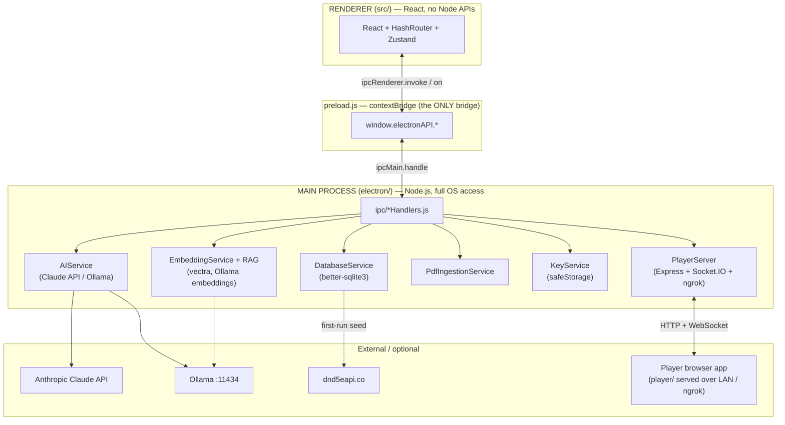

# Dungeon Master's Campaign Suite (DMCS)

**A local-first Electron desktop app that gives a D&D 5e Dungeon Master one place to run an entire campaign — world building, maps, characters, encounters, a compendium, optional AI, and live player views.**

DMCS solves the "twelve browser tabs and a stack of PDFs" problem. Everything a DM needs during prep and at the table — NPCs and factions, battle maps with fog of war, full 5e character sheets, encounter/initiative tracking, and a searchable monster/spell/item compendium — lives in a single offline desktop app backed by a local SQLite database. AI is **optional** and, when enabled, can answer rules questions from your own uploaded PDFs and import sourcebook content into the compendium. Players can connect to a read-only view of the map and their character sheet, either through a second Electron window or a browser over your LAN / an ngrok tunnel.

**Version:** 1.0.0 — all 8 build phases complete.

---

## Screenshot

> _UI/desktop app — add a screenshot of the main DM window (Campaign Manager or Map Engine) here._
> ``
> _(No screenshot is committed yet; the path above is a placeholder.)_

---

## Table of Contents

1. [Tech Stack](#tech-stack)
2. [Prerequisites](#prerequisites)
3. [Setup](#setup)
4. [Environment Variables](#environment-variables)
5. [Running the Project](#running-the-project)
6. [Architecture](#architecture)
7. [Project Structure](#project-structure)
8. [Core Usage (the IPC chain)](#core-usage-the-ipc-chain)
9. [Database Schema](#database-schema)
10. [Modules](#modules)
11. [AI Layer](#ai-layer)
12. [Player Views](#player-views)
13. [Testing](#testing)
14. [Building the Windows Installer](#building-the-windows-installer)
15. [Troubleshooting](#troubleshooting)
16. [Open Questions](#open-questions)
17. [License](#license)

---

## Tech Stack

Versions are transcribed from `package.json` (semver ranges as written there).

| Layer | Package | Version |
|---|---|---|
| Language | JavaScript + JSX | — (no `tsconfig.json`; `@types/*` are editor aids only) |
| Package manager | npm | `package-lock.json` committed |
| Node runtime | — | **Not pinned** — no `engines` field (see [Prerequisites](#prerequisites)) |
| Desktop shell | electron | `^33.2.1` |
| UI | react / react-dom | `^18.3.1` |
| Build tool | vite / @vitejs/plugin-react | `^6.0.1` / `^4.3.3` |
| Routing | react-router-dom | `^6.27.0` (**HashRouter** — see [Architecture](#architecture)) |
| State | zustand | `^5.0.1` |
| Database | better-sqlite3 (SQLite) | `^12.10.0` |
| Maps / canvas | konva / react-konva | `^10.3.0` / `^18.2.10` |
| Mind map | @xyflow/react (React Flow) / @dagrejs/dagre | `^12.11.0` / `^3.0.0` |
| AI — online | @anthropic-ai/sdk (Claude API) | `^0.100.0` |
| AI — offline | Ollama (local HTTP, no npm dep) | — |
| PDF parsing | pdf-parse | `1.1.1` (pinned via `overrides`) |
| Vector search | vectra | `^0.15.0` |
| Remote Player Network | express / socket.io / socket.io-client | `^5.2.1` / `^4.8.3` / `^4.8.3` |
| Tunnel / QR | @ngrok/ngrok / qrcode | `^1.7.0` / `^1.5.4` |
| Image export | html-to-image | `^1.11.13` |
| Packaging | electron-builder / @electron/rebuild | `^25.1.8` / `^4.0.4` |

> **Note:** These library choices are treated as locked for the project. Don't substitute them without updating this README and the `DMCS_*` spec docs.

---

## Prerequisites

### Required to run in development

- **Node.js 20–22** and **npm 10+** — pinned by `.nvmrc` (`20`) and `package.json`'s `"engines": { "node": ">=20 <23" }`. The upper bound is deliberate: `better-sqlite3` is a native module and Node 23+ has not been validated against Electron 33's ABI. See [Troubleshooting](#better-sqlite3-node_module_version-mismatch) for what goes wrong.
- **Native build toolchain** for compiling `better-sqlite3` during `npm install`:
  - **Windows:** Python 3 + Visual Studio Build Tools (C++)
  - **macOS:** Xcode Command Line Tools
  - These are needed only to *install/build* the app, never by end users of the packaged installer.

> ⚠️ **Path-with-spaces caveat:** `node-gyp` (used during `npm install`'s native build) can fail on directories containing spaces. If `npm install` fails on `better-sqlite3`, install from a space-free path (e.g. `C:\dev\dmcs`).

### Optional (only for AI features)

- **Anthropic API key** — for online Claude features. Entered in the app's Settings (stored via Electron `safeStorage`), not as an env var.
- **Ollama** — for fully offline AI. Install from [ollama.com](https://ollama.com), then pull the models DMCS uses:
  ```bash
  ollama pull llama3            # chat / extraction model
  ollama pull nomic-embed-text  # required for PDF embedding + RAG
  ```
- **ngrok auth token** — only if you want remote players to connect over the internet (entered in Settings).

The base app is fully usable with **no AI and no network**.

---

## Setup

```bash
# 1. Clone
git clone git@github.com:Dreadseer/Dungeon-Master-Campaign-Suite.git
cd "Dungeon Master Campaign Suite"

# 2. Install dependencies
#    postinstall runs: electron-rebuild -f -w better-sqlite3
#    (rebuilds the native SQLite module for this Electron version)
npm install

# 3. Launch in development
npm run dev
```

`npm run dev` runs two processes in parallel (via `concurrently`):
- **Vite dev server** on `http://localhost:5173`
- **Electron** (with `NODE_ENV=development`), which waits for Vite then loads it.

On first launch DMCS will, automatically:
1. Create its SQLite database under the OS user-data directory (see [Where is the database?](#where-is-the-database)).
2. Run all **8** database migrations in order (`DatabaseService.runMigrations()`).
3. Seed the SRD cache (monsters, spells, equipment, classes) from `https://www.dnd5eapi.co` — **once**, over the network, then cached locally.

**Verified in this environment:** `npm install` and `npm run build:renderer` (`vite build`) both succeed. The full installer build is covered in [Building the Windows Installer](#building-the-windows-installer). `npm run dev` opens a GUI and was not exercised headlessly.

---

## Environment Variables

DMCS uses **one** environment variable, and there is **no `.env` file** — nothing is required to run it.

| Name | Required? | Purpose | Set by |
|---|---|---|---|
| `NODE_ENV` | No | `=== 'development'` selects the Vite dev server; otherwise the packaged renderer is loaded from disk. Read at `electron/main.js:23,53,122` and `electron/server/PlayerServer.js:25`. | Automatically by the npm scripts (`cross-env NODE_ENV=development`). You do not set it manually. |

Secrets are **not** env vars: the Anthropic API key and ngrok token are entered in the app UI and encrypted with Electron `safeStorage` (`electron/services/KeyService.js`).

---

## Running the Project

| Command | What it does |
|---|---|
| `npm run dev` | DM app: Vite dev server (`:5173`) + Electron with hot reload for React. |
| `npm run dev:player` | Browser player app dev server (Vite on `:5174`), proxying `/api` and `/socket.io` to the Express server on `:3001`. |
| `npm run build:renderer` | Production build of both renderers → `dist/renderer/` (DM) and `dist/player/` (browser player). |
| `npm run build` | `build:renderer`, then `electron-builder` (packages for the current OS). |
| `npm run build:win` | `build:renderer`, then the Windows NSIS installer (`electron-builder --win nsis --x64`). See [Building the Windows Installer](#building-the-windows-installer). |
| `npm run electron` | Runs Electron against an already-running Vite server. |

**Hot reload:** Vite hot-reloads everything under `src/`. The Electron **main process does not hot-reload** — after editing anything in `electron/`, quit and restart `npm run dev`.

---

## Architecture

### Two-process model

Electron runs two isolated JavaScript environments that cannot share memory. All database, file, AI, and server work happens in the **main process**; React runs in the sandboxed **renderer** and reaches main only through a narrow `window.electronAPI` bridge exposed by `preload.js`.



> **Rule:** Never `import` `better-sqlite3`, `fs`, `path`, `@anthropic-ai/sdk`, `express`, etc. inside `src/` — it crashes the renderer. Everything crosses through IPC.

### Why HashRouter (not BrowserRouter)

The renderer uses **`HashRouter`** (`src/App.jsx`). In a packaged build the renderer is loaded from disk with `loadFile(...)` (a `file://` URL), where path-style routing can't resolve deep routes like `/player`. Hash routing keeps the route in the URL fragment (`index.html#/player?campaign=1`), which resolves correctly from `file://`. The secondary windows (Player View, pop-out combat map) rely on this.

---

## Project Structure

Top two levels, annotated. `dist/`, `node_modules/`, and the `DMCS_*.md` design/spec docs are omitted.

```
Dungeon Master Campaign Suite/
├── electron/                 # MAIN process (Node.js)
│   ├── main.js               # Entry: window creation, service wiring, IPC registration
│   ├── preload.js            # contextBridge → window.electronAPI (the only renderer bridge)
│   ├── database/             # DatabaseService.js — SQLite connection, 8 migrations, CRUD
│   ├── services/             # AIService, EmbeddingService, RAGService, PdfIngestionService,
│   │                         #   SrdService, KeyService
│   ├── ipc/                  # *Handlers.js — ipcMain.handle for db:/ai:/srd:/pdf:/embed:/…
│   └── server/               # PlayerServer.js — Express + Socket.IO for the browser player
│
├── src/                      # RENDERER (React) — DM window
│   ├── main.jsx / App.jsx    # React entry; HashRouter + routes
│   ├── PlayerApp.jsx         # Root for the in-app Electron Player View (#/player)
│   ├── pages/                # One file per module (CampaignManager, MapEngine, Compendium, …)
│   ├── components/           # Feature + shared components (map/, character/, compendium/, …)
│   ├── stores/               # Zustand: campaignStore (persisted), playerStore
│   └── utils/                # Pure helpers: dnd5e.js, fogUtils.js, compendiumExtractor.js, …
│
├── player/                   # Browser player web app (separate Vite build → dist/player)
│   ├── main.jsx / PlayerWebApp.jsx / index.html / components/
│
├── tools/                     # dmcs-agent.mjs — unrelated LM Studio experiment (see tools/README.md)
├── scripts/                  # verify-migration-009.mjs + verify-ipc-layers.mjs (npm-wired),
│                             # plus manual verify-*.js scripts and the screenshot driver
├── assets/                   # electron-builder buildResources (icon.png)
├── vite.config.js            # DM renderer build (base './', outDir dist/renderer)
├── vite.player.config.js     # Browser player build (root player/, outDir dist/player, dev :5174)
└── package.json              # Scripts + electron-builder "build" config
```

---

## Core Usage (the IPC chain)

Every database/AI/file call from React follows the same four-layer path. To add a feature you must touch **all four layers** or it silently no-ops.

`npm run test:ipc` checks the two layers that can be checked statically — it cross-references every `ipcRenderer.invoke` literal in `preload.js` against every `registerHandler` literal in `electron/ipc/*.js` and `electron/main.js`, and fails on a channel that exists on only one side. Run it after adding a channel.

```
React component
    │  window.electronAPI.db.subclasses.create(data)
    ▼
electron/preload.js
    │  ipcRenderer.invoke('db:subclasses:create', data)
    ▼
electron/ipc/dbHandlers.js
    │  registerHandler('db:subclasses:create', (_, data) => global.db.createSubclass(data))
    ▼
electron/database/DatabaseService.js
    │  this.db.prepare('INSERT INTO subclasses …').run(…)
    ▼
SQLite file on disk
```

Real call sites from the current code (all verified in `electron/preload.js`):

```javascript
// Database CRUD
const rows   = await window.electronAPI.db.pdf.getAll(activeCampaign.id)
await window.electronAPI.db.subclasses.create({ class_name, name, description, unlock_level, features })

// AI completion (system, user, options) — options.maxTokens is threaded through
const raw    = await window.electronAPI.ai.complete(system, user, { maxTokens: 8192 })
// getMode resolves to an OBJECT, not a string. Destructure it — comparing the
// whole result to 'no-ai' is silently always false, which is exactly the bug
// Phase 1 fixed in AISuggestionPanel.
const { mode } = await window.electronAPI.ai.getMode()  // 'online' | 'offline-ollama' | 'no-ai'

// Semantic search over indexed PDF chunks (used by the Source Book Importer)
const chunks = await window.electronAPI.embed.search(query, topK, itemKeys, sourceId)
```

### Errors

Every `window.electronAPI.*` call must be wrapped. Main-process handlers all run
through `registerHandler` (`electron/ipc/registerHandler.js`), which logs
`[ipc] <channel> failed:` with the full error and rethrows a clean message; the
renderer turns that into a toast:

```javascript
import { notifyError, notifySuccess } from '../stores/toastStore'

try {
  await window.electronAPI.db.locations.delete(loc.id)
  notifySuccess(`Deleted "${loc.name}".`)
  load()                       // reload ONLY on success
} catch (err) {
  notifyError(err, 'Delete location')
}
```

`notifyError` parses Electron's `Error invoking remote method '<channel>':`
wrapper off the message and rewrites the common database failures into plain
language (`FOREIGN KEY constraint failed` → "Something else still refers to
this. Remove or reassign it first."), keeping the raw text behind a "Show
details" toggle. Unrecognised messages pass through verbatim.

Do not reload the list in the `catch`. The row is still there, and re-fetching
makes a failed delete look like nothing was attempted.

See [`DMCS_Source_Book_Importer.md`](DMCS_Source_Book_Importer.md) for a worked end-to-end example (search → extract → parse → save).

---

## Database Schema

The database is created and migrated automatically on first launch — you never run migrations manually. `DatabaseService.runMigrations()` applies these in order:

| ID | Name | Adds |
|---|---|---|
| 001 | `core_schema` | Base tables (campaigns, locations, factions, npcs, connections, characters, encounters, maps, compendium_custom, srd_cache, mind_map_positions) |
| 002 | `connections_lore` | `campaign_id` on connections; `'lore'` type in `compendium_custom` |
| 003 | `pdf_chunks` | `pdf_sources` + `pdf_chunks` tables (RAG pipeline) |
| 004 | `embedding_columns` | `embedded` / `embedding_model` columns on `pdf_chunks` |
| 005 | `ai_usage_log` | `ai_usage_log` table |
| 006 | `subclasses` | `subclasses` table (+ seed subclasses) |
| 007 | `encounter_map_loc_fields` | Encounter ↔ map/location linking fields |
| 008 | `compendium_source_book` | Source-book / page attribution fields on compendium entries |

> Registered at `electron/database/DatabaseService.js:24-32`. Exact column definitions live in the `MIGRATION_00N` constants in that file.

Several columns store JSON strings (SQLite has no JSON type) — always `JSON.parse()` on read and `JSON.stringify()` on write. Examples: `characters.stats`, `characters.inventory`, `characters.spell_slots`, `maps.fog_data`, `maps.tokens`, `encounters.monsters`, `subclasses.features`.

### Where is the database?

The path depends on how DMCS is running, because Electron derives the user-data folder from the app name:

| Context | App name source | Windows path |
|---|---|---|
| **Development** (`npm run dev`) | `package.json` `"name": "dmcs"` | `%APPDATA%\dmcs\dmcs.db` |
| **Packaged / installed** | `build.productName` `"DM Campaign Suite"` | `%APPDATA%\DM Campaign Suite\dmcs.db` |

macOS/Linux follow the same pattern (`~/Library/Application Support/<name>/` and `~/.config/<name>/`). **Consequence:** campaigns created with `npm run dev` do **not** appear in the installed app — they live in different folders. Inspect either file with [DB Browser for SQLite](https://sqlitebrowser.org/).

### Adding a new table (all four IPC layers)

1. Add `const MIGRATION_010 = \`CREATE TABLE …\`` in `DatabaseService.js`. **(ids 1–9 are taken.)** Never edit an existing `MIGRATION_00N` — migrations are append-only.
2. Append `{ id: 10, name: 'my_table', sql: MIGRATION_010 }` to the `migrations` array.
3. Add CRUD methods to `DatabaseService`.
4. Register `registerHandler('db:myTable:*', …)` in `electron/ipc/dbHandlers.js`.
5. Expose them on `window.electronAPI.db.myTable.*` in `electron/preload.js`.
6. Call from React: `await window.electronAPI.db.myTable.getAll(campaignId)`, in a `try`/`catch`.
7. Run `npm run test:ipc` to confirm the channel names match across layers.

**Changing a foreign key or a CHECK constraint** is different: SQLite cannot
`ALTER` either one, so the table has to be recreated (create new, `INSERT ...
SELECT` with an explicit column list, drop old, rename new — never rename the
*old* table, or SQLite rewrites every child table's `REFERENCES` clause to point
at your temporary name). That procedure needs foreign keys disabled and has to be
atomic, and `PRAGMA foreign_keys` is silently ignored inside a transaction — so
mark the entry `foreignKeysOff: true` and the runner handles the toggle,
transaction and `PRAGMA foreign_key_check` for you. `MIGRATION_009` is the worked
example.

---

## Modules

| Module (page) | Summary |
|---|---|
| Campaign Manager | Create / load / rename / delete campaigns; the active campaign is held in `campaignStore` (persisted to `localStorage`). |
| World Builder | Factions, Locations, NPCs, Lore, and named Connections; optional AI suggestion panel. The separate "Lore & Connections" page was removed in Phase 1 — it duplicated `/world/lore` and `/world/connections`. |
| Mind Map | React Flow graph of all world entities with Dagre auto-layout and PNG export. |
| Map Engine | Upload battle maps, paint fog of war, place tokens; opens a pop-out combat-map window. |
| Compendium | Browse SRD monsters/spells/equipment + homebrew, **and** the [Source Book Importer](DMCS_Source_Book_Importer.md) (📥 Single / 📦 Bulk) that turns indexed PDF passages into structured entries via AI. |
| Character Sheets | Full 5e sheets (stats, inventory, spell slots, death saves) with a level-up wizard and AI assistant. |
| Encounter Builder | Build encounters from SRD monsters; XP/difficulty calculator; initiative tracker with HP sync back to characters. |
| Combat Calculator | Standalone XP/CR calculator. |
| AI Assistant | Streaming chat with campaign context injected; "Rules Q&A" routes through the RAG pipeline. |
| AI Sources | Upload PDFs, monitor indexing, trigger embedding. |
| Settings | Anthropic key (safeStorage), Ollama status, RAG settings, ngrok token, AI usage stats. |

---

## AI Layer

On startup the app picks a mode (shown as a badge in the TopBar):

1. Valid Anthropic key in `safeStorage` → **`online`** (Claude API, model `claude-sonnet-5`).
2. Else Ollama reachable at `http://localhost:11434` → **`offline-ollama`** (`llama3:latest` chat).
3. Else **`no-ai`** — all AI features hide; the rest of the app works normally.

**RAG / PDF pipeline:** upload a PDF → `PdfIngestionService` chunks it (~400 tokens) into `pdf_chunks` → `EmbeddingService` embeds each chunk with Ollama `nomic-embed-text` into a `vectra` index → on a query, the top-k chunks are retrieved (with contiguous-chunk stitching) and sent to the model, which answers with page-number attribution. Embeddings require Ollama running even when chat is online.

---

## Player Views

DMCS has **two** distinct ways for players to see content:

1. **In-app Electron Player View** — a second `BrowserWindow` loading `#/player?campaign=<id>` (`electron/main.js` `createPlayerWindow`). Fog-enforced map (solid black over hidden cells), read-only character sheet, and live DM broadcasts relayed through the main process.
2. **Remote Player Network (browser)** — `electron/server/PlayerServer.js` runs an Express + Socket.IO server (default port **3001**, auto-increments if busy, binds `0.0.0.0`) that serves the `player/` web app. Players join from a browser over the LAN, or over the internet via an **ngrok** tunnel, using a QR code. See [`DMCS_Remote_Player_Network.md`](DMCS_Remote_Player_Network.md).

---

## Testing

```bash
npm test              # vitest run — one pass, exits non-zero on failure
npm run test:watch
npm run test:migrations   # replays migrations 001-009 on a fresh AND a populated database
npm run test:ipc          # cross-checks channel names across the preload/handler layers
```

The two `node` scripts run on Node's built-in `node:sqlite` and on plain source
parsing respectively, so neither needs a working native `better-sqlite3` build.

**Vitest**, configured inside the existing `vite.config.js` (`test` block) rather than a separate
config file. Environment is `node`; suites are discovered at `src/**/__tests__/**/*.test.js`. There is
no jsdom and no component testing yet — everything covered so far is a pure ES module.

| Suite | Covers |
|-------|--------|
| `src/utils/__tests__/encounterUtils.test.js` | All 80 `XP_THRESHOLDS` values against DMG 2014 p. 82, the six encounter-multiplier bands, CR→XP, party thresholds, difficulty ratings, `xpBudget` |
| `src/utils/__tests__/fogUtils.test.js` | Row-major index math, brush clamping at every map edge and corner, grid dimensions for non-divisible images, viewport culling |
| `src/utils/__tests__/combatUtils.test.js` | Initiative sort and DEX tiebreak, monster count expansion, turn wraparound, the 15 PHB conditions |
| `src/utils/__tests__/ipcError.test.js` | Unwrapping Electron's IPC rejection envelope; plain-language rewrites of the seven common database/filesystem failures |
| `src/utils/__tests__/locationUtils.test.js` | Ancestor-chain walking, cycle detection at any depth, the 50-hop bound |

### Known bugs are recorded as tests, not comments

Where a bug is known but not yet fixed, the suite holds **two** tests for it: one that passes and pins
the current (wrong) behaviour, and one marked `it.fails` asserting the *correct* behaviour. `it.fails`
passes only while its body throws — so when the fix lands, that test starts erroring and forces
someone to delete the modifier. It is a tripwire, not a skip. Each is paired with a `test.todo`, which
is why `npm test` reports a non-zero todo count.

**If a test in a `KNOWN BUGS` block fails after your change, that is usually good news** — read the
comment above it, delete the `.fails`, and remove the paired "current behaviour" test.

### What is *not* covered

No React component has a test — the toast queue, the error surfaces and every page are unexercised by
Vitest. Electron main-process *code* has no unit tests either, though the migration SQL and the IPC
channel wiring are now checked by the two `node` scripts above. The manual scripts remain the only
coverage for the services:

- `scripts/verify-*.js` / `*-electron.js` — **manual** verification scripts run in an Electron/Node
  context (e.g. `verify-db-electron.js`, `verify-srd-electron.js`, `verify-ai-electron.js`). They are
  not wired to an npm script and must be invoked directly. The `*-electron.js` variants must run
  inside Electron — see the ABI note in [Troubleshooting](#better-sqlite3-node_module_version-mismatch).
- `scripts/screenshot-driver.mjs` — a `playwright-core`-based screenshot helper.

---

## Building the Windows Installer

Produces `DMCS-Setup-1.0.0.exe` for non-technical Windows users. Full detail — including checklists — is in [`DMCS_RELEASE_GUIDE.md`](DMCS_RELEASE_GUIDE.md).

```bash
npm install        # first time only
npm run build:win  # → dist/app/DMCS-Setup-1.0.0.exe  (and dist/app/win-unpacked/)
```

**One-time Windows prerequisite:** electron-builder extracts a `winCodeSign` toolchain that contains symlinks, which Windows only allows with **Developer Mode enabled** (Settings → System → For developers) *or* an **Administrator** terminal. Without it, `win-unpacked/` is still produced but the final installer `.exe` fails with `Cannot create symbolic link`.

Notes:
- Close the running DMCS app before building (avoids a file lock on `better_sqlite3.node`).
- The build ships **unsigned**, so Windows SmartScreen shows "Windows protected your PC" — testers click **More info → Run anyway**. Code signing is a future step.
- App icon: drop a square `assets/icon.png` (see `assets/README.md`); electron-builder generates the `.ico`.

---

## Troubleshooting

### Blank white screen on launch
Vite wasn't ready when Electron started. Wait a moment and press `Ctrl+R`. If persistent, check the terminal for Vite errors.

### `better-sqlite3` "NODE_MODULE_VERSION mismatch"

**The cause: DMCS has two JavaScript runtimes, and `better-sqlite3` can only be compiled for one at a
time.** It is a *native* module - a `.node` binary compiled in C++ against a specific V8 ABI, stamped
with a `NODE_MODULE_VERSION` number. Electron 33 embeds its own V8 and reports ABI **130**; the Node
24 you may have on your `PATH` reports **137**. A binary built for one refuses to load in the other,
which is why the same install can work under `npm run dev` (Electron loads it) and fail under a plain
`node script.js` (Node loads it) - or the reverse, depending on which runtime it was last built for.

`npm install` compiles it against **Node**. The `postinstall` hook then runs `electron-rebuild`, which
recompiles it against **Electron**. So after a successful install the binary is Electron-flavoured, and
any `scripts/verify-*.js` run under bare `node` will fail - that is expected. The `*-electron.js`
variants exist precisely because they run inside Electron, where the ABI matches.

To rebuild for Electron (the normal case - the app won't start):
```bash
npm run postinstall
# or: ./node_modules/.bin/electron-rebuild -f -w better-sqlite3
```

To rebuild for Node (only if you need `better-sqlite3` from a bare `node` script):
```bash
npm rebuild better-sqlite3
```
...then re-run `npm run postinstall` before launching the app again.

**Prevention:** use the pinned runtime. `.nvmrc` contains `20` and `package.json` declares
`"engines": { "node": ">=20 <23" }`. Node 23+ has not been validated against this Electron version's
ABI, and Node 24 is the exact configuration that produces the 130-vs-137 mismatch above.

### SRD never loads / compendium empty
The first-run seed fetches from `https://www.dnd5eapi.co`. If you were offline it failed silently — Settings → **Re-seed SRD** once online.

### AI badge shows "No AI"
No key saved, Ollama not running, or an invalid key. Add a key in Settings, or run `ollama serve` and restart.

### Changes to `electron/` don't take effect
The main process doesn't hot-reload. Quit (`Ctrl+C`) and re-run `npm run dev`.

### IPC call returns `undefined`
The channel is missing in `dbHandlers.js`/`aiHandlers.js` or not exposed in `preload.js`. Channel names are case-sensitive and must match exactly across all three layers.

---

## Open Questions

Items I could **not** verify from the repository (honest unknowns, not guesses):

- **No LICENSE.** There is no `LICENSE` file and no license/credits/attribution text anywhere in the repo. The project's license is therefore **unspecified** — add one (or state "all rights reserved") before any public distribution.
- ~~**`agent/dmcs-agent.mjs`** is a standalone CLI that talks to a local **LM Studio** server…~~ **Resolved in Phase 0:** moved to `tools/dmcs-agent.mjs` and labelled in `tools/README.md` as a dev experiment unrelated to the app's AI architecture (Anthropic online / Ollama offline). Still not imported by anything.
- ~~**Migrations 007/008 column details** were confirmed by name only…~~ **Resolved in Phase 0:** all 8 migrations were executed against a fresh database and against one already holding rows. 007 adds `encounters.map_id`, `locations.has_own_map` and `locations.floor_number`; 008 recreates `compendium_custom` to widen its `source` CHECK to include `'source_book'`, preserving existing rows. See `docs/BUILD_STATUS.md`.
- **`npm install`'s `postinstall` (`electron-rebuild`) fails on the development machine** at the node-gyp step, so `better-sqlite3` is currently compiled for **Node** (ABI 137), not Electron (ABI 130) — meaning `npm run dev` will hit the mismatch until the rebuild succeeds. Two documented candidates: this repository's path contains spaces, and the native toolchain may be incomplete. Not diagnosed further in Phase 0.
- **`react-konva@18.2.10` declares a peer range of `konva` ^7/^8/^9 while the project runs `konva` ^10.** The installed tree works, but a clean `npm install` fails with `ERESOLVE` without `legacy-peer-deps` (now set in `.npmrc`). Whether to downgrade konva or move react-konva is unresolved.
- **`npm run dev` (GUI)** and the packaged **installer `.exe`** were not run to completion in the documentation environment (no display / symlink privilege); the underlying builds (`build:renderer`, `win-unpacked`) were verified.
- **macOS/Linux packaging** (`dmg` / `AppImage` targets exist in `build`) is unverified — only the Windows path has been exercised.
- **Screenshot** referenced in the Screenshot section does not exist yet.

---

## License

**No license is currently declared** for this project (no `LICENSE` file present). Until one is added, all rights are reserved by the author. Author: **Christopher Clarke** (`package.json` `"author"`).
